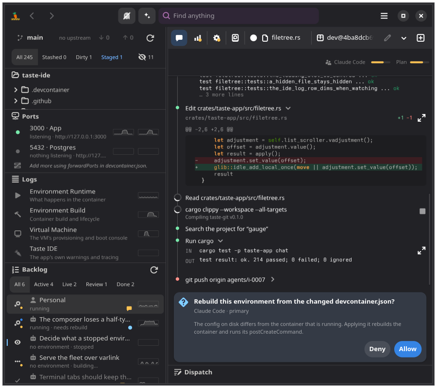
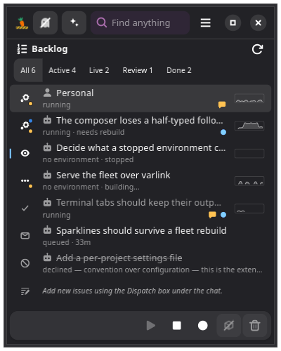
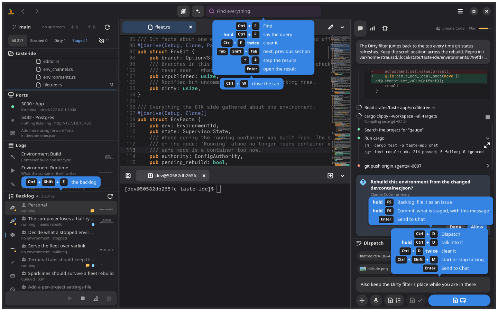

# Taste, an opinionated IDE for Bluefin and Silverblue

Taste is all you need.

An AI-supported coding IDE: Rust, GTK4/libadwaita, Flatpak-first,
devcontainer-native, with the
[Agent Client Protocol](https://agentclientprotocol.com) as the agent
abstraction. Files on the left, editor in the center, console on the
bottom, agent chat on the right, and no other arrangement. Convention over
configuration over code: projects behave uniformly because things live in
fixed places, not because each repo scripts its own behavior.

Every environment, your own included, runs in a VM the IDE provisions for
the workspace. Nothing a project needs is layered onto the OS, and there is
no mode that runs a project's code on the host with less isolation. The
design and its non-negotiables: [docs/ARCHITECTURE.md](docs/ARCHITECTURE.md)
and [docs/ENVIRONMENTS.md](docs/ENVIRONMENTS.md).


## What it looks like

The backlog is a git ref, and every issue an agent works on is an
environment with its own checkout, container, and chat.


Watching an environment aims every pane at its checkout, read-only, with
its agent's conversation on screen.


A branch an agent published is reviewed in the file tree, file by file,
and merged or rejected from the diff.


The chat's Utilization tab says what the conversation is spending and
where the subscription stands.


Narrow windows fold the panes into one strip rather than dropping any of
them, and a gadget face keeps the fleet in view at a glance.





Hold F1 and every key says what it does.



## Security model

The bar: a project you open should be able to do no more to you than a
random VM on the internet could. It can run anything, spend its own
resources, and reach the network. It cannot read your home directory,
use your ssh keys, push to your repositories, or start a process on your
machine.

How Taste meets it:

- **Every container runs in a VM the IDE provisions**, one pool per
  workspace, with your checkout inside it. A project's build steps, its
  lifecycle hooks, its dev server, and its agent never touch your
  kernel, and one workspace's VM cannot see another's.
- **Nothing of yours is mounted in.** No `$HOME`, no ssh agent, no
  credential helper. The Anthropic credential lives in a host-side proxy
  and the agent gets a placeholder; the project spends the allocation
  and never holds the bytes.
- **Git that touches a working tree runs in the VM**, hooks and filters
  included. The folder you opened is a git peer: it fetches refs from
  the VM over ssh with a generated identity, and only your own Push and
  Pull run host git with your keys. Agent git cannot push anywhere, by
  configuration and by the absence of any credential to push with.
- **Agents author and apply, in the VM.** An agent may write
  `.devcontainer/` and rebuild into it without asking, because the build
  and its lifecycle commands run in the VM and nothing of yours is in
  reach; you are told once, at the end, whether it worked. Repo-supplied
  configs are still vetted, and anything that would reach the host
  (`--privileged`, host network, arbitrary binds, devices) is refused or
  stripped.
- **What is left is written down**, not implied: the residual list in
  [docs/ENVIRONMENTS.md](docs/ENVIRONMENTS.md) → "The residual, as it
  stands" names every host process that still parses project-controlled
  bytes — the host `git` fetching from the VM, libgit2 fast-forwarding
  your folder, WebKit on a dev server's page, qemu itself.

Compared with the IDEs most people are coming from, as they work by
default and as their own documentation describes them:

| | Taste | VS Code with Dev Containers | GitHub Codespaces | JetBrains, Cursor, and most others |
| --- | --- | --- | --- | --- |
| Where project code runs | A VM per workspace on your machine, never the host kernel | A container on the host's Docker or Podman, sharing the host kernel | A VM per codespace in Microsoft's cloud | On the host, as you |
| Where the checkout lives | In the VM; your folder is a git peer | On the host, bind-mounted into the container | In the cloud VM; your code and its history live on their servers | On the host |
| Credentials in the project's reach | None; a proxy holds the AI credential | Git credentials and the ssh agent are forwarded into the container by design | A GitHub token with repository scope is injected into every codespace | Everything you can reach |
| Who applies a config change | The agent or you, in the VM; you are told how it ended | The extension, on reopen; Workspace Trust gates the rest | The service, on rebuild; prebuilds run it unattended | Plugins and tasks run with your privileges |
| Agent commands | In the VM only; a host fallback is refused, never taken | In the container, or on the host for host-side agents | In the codespace | On the host, behind an allowlist or a prompt |
| What can still reach you | The residual list above, each item bounded and named | The kernel, the forwarded credentials, the host-side extension process | Little of your machine; all of your code, on a proprietary service you do not run | The process is you |
| Privacy and ownership | Local, free software, your hardware, your bill | Local; the editor is Microsoft's build of an open core | Your source, your terminal, and your agent's traffic on Microsoft's infrastructure, metered by the hour | Local, mostly proprietary |

Codespaces is the closest in shape — a VM per workspace, the checkout
inside it, nothing of your machine mounted in — and the difference is
where that VM is and who owns it. Codespaces reaches its isolation by
moving your project onto a proprietary service; Taste reaches the same
isolation on your own hardware, with the same devcontainer.json, and
nothing leaves the machine but what you push.

None of this is a claim that the other tools are careless: they are
built for trusting the project you open. Taste is built for not having
to.

### How agents work with the IDE

A separate comparison, because it is a separate question: not what a
project can do to you, but what shape the agent's work takes. The
AI-first editors most people are using today, as they work by default:

| | Taste | Cursor | Windsurf | VS Code with Copilot agent mode | Zed |
| --- | --- | --- | --- | --- | --- |
| Agent | Any [ACP](https://agentclientprotocol.com) agent; Claude Code is the pinned default | Cursor's own, over its models | Windsurf's own (Cascade), over its models | Copilot, over GitHub's model menu | Zed's own, plus external agents over ACP |
| Where the agent process runs | Inside the environment's container, in the VM | On your machine, as you | On your machine, as you | On your machine, as you | On your machine, as you |
| How it reads and writes files | Through the IDE: unsaved buffers on read, edits applied into your undo stack | Directly on disk, with diffs shown | Directly on disk, with diffs shown | Directly on disk, with diffs shown | Directly on disk, with diffs shown |
| How it runs commands | In the container only, through one exec surface of record; a host fallback is refused | A host terminal, behind an allowlist or a prompt | A host terminal, behind an allowlist or a prompt | A host terminal, behind a prompt | A host terminal, behind a prompt |
| Unit of work | An issue: its own clone, container, branch, and chat; a fleet of them, supervised from one orchestrator chat | One chat in one checkout, background agents as a paid tier | One chat in one checkout | One chat in one checkout | One chat in one checkout |
| Review | Its branch, file by file in the tree, merged or rejected from the diff, fast-forward only | Accept or reject hunks in the editor | Accept or reject hunks in the editor | Accept or reject hunks in the editor | Accept or reject hunks in the editor |
| Who applies a config the agent wrote | The agent, in the VM; you are told how it ended | The agent, or you, on your machine | The agent, or you | The agent, or you | The agent, or you |
| The credential | The project's, held by a host proxy; the agent sees a placeholder | Your account, in the app | Your account, in the app | Your GitHub account | Your account or your keys, in the app |

The shape Taste takes — an environment per issue, agents that live
beside the files they change, an orchestrator that files and reviews
work rather than a chat that types into your buffer — is the design
commitment in [docs/ARCHITECTURE.md](docs/ARCHITECTURE.md). The other
editors are a chat beside an editor, and are very good at that.

## Build and run

The host is Bluefin or Silverblue with podman; the toolchain lives in this
repository's devcontainer. Environments run in VMs, so the host also wants
a user-session libvirt and qemu, which Bluefin DX ships and the standard
images do not.

```sh
git clone <this-repo> taste-ide && cd taste-ide
./bootstrap.sh            # build the devcontainer image on host podman, build the IDE in it, launch it on this repo
./bootstrap.sh --host     # build in that devcontainer on host podman, run the binary on the host against $PWD
./bootstrap.sh --flatpak  # the production build: a per-user Flatpak, installed and launched
```

The bootstrap's devcontainer is the one container that runs on the host's
own podman: this repository's toolchain building this repository. Every
environment the running IDE opens, your own included, goes into a VM of
the workspace's pool, which is why the host wants libvirt even for the
`--host` run.

Any cargo command runs the same way, on host podman:

```sh
podman run --rm --userns=keep-id:uid=1000,gid=1000 \
  -v "$PWD:/workspaces/taste-ide:z" -v taste-ide-cargo:/home/dev/.cargo \
  taste-ide-devcontainer cargo test --workspace
```

One host setting is worth changing: rootless podman spends your uid's
inotify budget for every container, and the default of 128 runs out under
a fleet.

```sh
sudo tee /etc/sysctl.d/90-inotify.conf <<'EOF'
fs.inotify.max_user_instances = 1024
EOF
sudo sysctl --system
```

Credentials are the project's: open a Claude Code chat's **Settings** and
sign in under **Anthropic account**. Nothing is read from the machine.

[CLAUDE.md](CLAUDE.md) has the house rules and the headless probes;
[build-aux/flatpak/README.md](build-aux/flatpak/README.md) the packaging.

## License

GPL-3.0-or-later.
