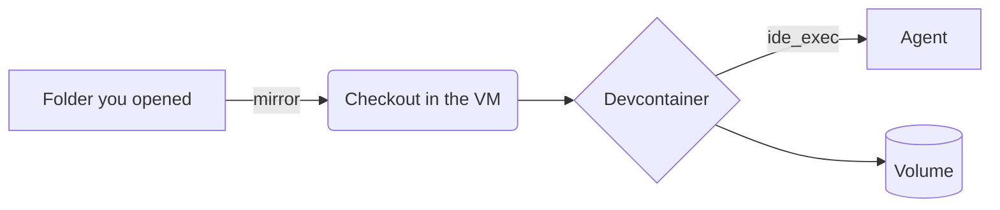
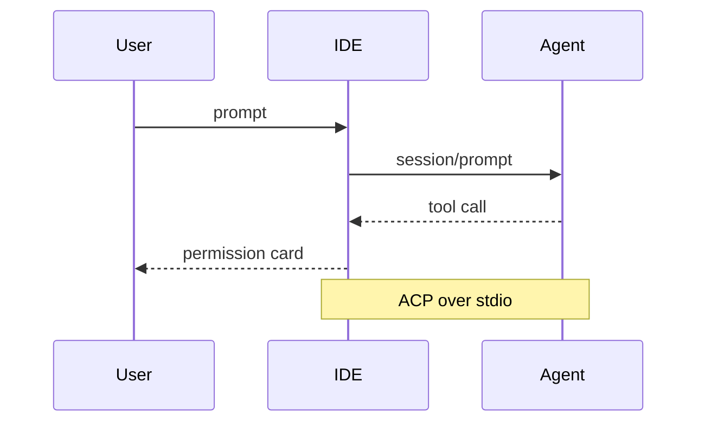

# Diagrams

How a workspace's files reach the agent:

```mermaid
flowchart LR
  F[Folder you opened] -->|mirror| C(Checkout in the VM)
  C --> D{Devcontainer}
  D -->|ide_exec| A[Agent]
  D --> V[(Volume)]
```

A prompt, end to end:

```mermaid
sequenceDiagram
  participant U as User
  participant I as IDE
  participant A as Agent
  U->>I: prompt
  I->>A: session/prompt
  A-->>I: tool call
  I-->>U: permission card
  Note over I,A: ACP over stdio
```

And one that does not parse, which shows as code with the reason:

```mermaid
flowchart LR
  A -->
```
